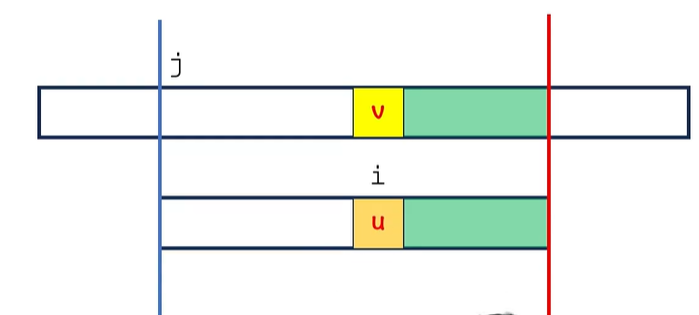

# 每个代码名称对应算法名称

brute_force 为 暴力算法,复杂度**最高O(nm)**

Sunday相比更加**高效**,复杂度**最高O(n/m)**

两者区别:前者模式串每次**向右移动一位**，而后者每次**向右移动若干位**

## Boyer Moore

该算法为Sunday算法的前身，**常考算法**

思路:**从后向前**进行匹配，遇到不同的字符(我们成为"坏字符")就将模式串最靠后出现该字符的项与之对齐（称为"坏字符规则"）

### bug:

若对其，会发现文本串向前移动

### 修正：好后缀规则

#### 情况一:

1.在j位置前,能找到完整j后的后缀

2.将向后滑动距离记录在delta2[j]中(delta2[j] = d2 = m - i - 1)

#### 情况二

目标:移动以后,能匹配成功

1.当初能找到完整的后缀匹配

2.蓝色部分不是最长的后缀匹配

### 总结

1.通过字符v,得到delta1[v]

2.通过位置i,得到delta2[i]

3.j += max(i-delta1[v],delta2[i])

